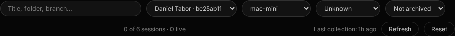
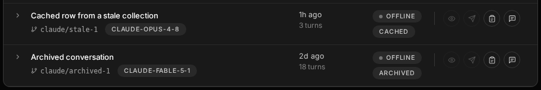
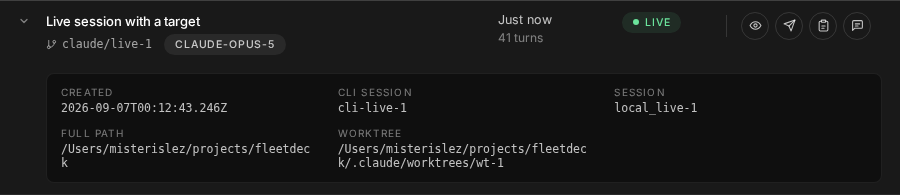
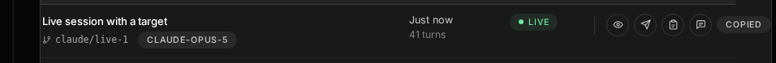
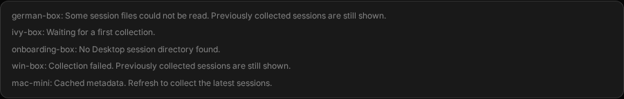
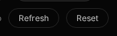

# Fleetdeck v2 — improvisation log

Every shape or behaviour the mock leaves open, decided by a worker, gets one entry here: what was
decided, which ledger row or open item it serves, and why. An improvisation without an entry fails
review (operator rule, `plan.md` §"Improvisation rule"). Screenshots are required for visual
improvisations; data-only entries do not need them.

---

## L1 — data layer, fixture mode, v2 routing (Juergen, `agent-v2-l1`, 2026-09-07)

### I-L1-01 — The seed arrays are not data; adapters and the fixture carry the *data* layer only

**Serves:** the whole of L1 (`README.md` §Scope 1, §Acceptance rows 2 and 3), ledger rows D06/D18–D20.

The mock's seed arrays are local `const`s inside `AppLogic.renderVals()`
(`mock/Fleetdeck Final.dc.html` L1245–L2004). They are not JSON. Each element mixes three layers:

| Layer | Example | Owner |
|---|---|---|
| 1 · data | `regData[].s/g/tk/st`, `tiles[].name/box`, `keyRows[].fp` | **L1** |
| 2 · derived presentation | `dotStyle: dot(t.good)`, `provStyle: chipTone('neutral')`, `lines[].style`, `trendPts` | the compiled template (S2) |
| 3 · behaviour | `openTerm`, `toggle`, `show`, `copyConv` — arrows added by trailing `.map()` chains | the screen slices (L2–L10) |

**Decision: L1 emits layer 1 only** — precisely the fields named in `diff.md` §"Binding map" — and both
the adapters and `fixture.js` emit that same layer-1 projection.

**Why.** Layer 2 is computed from the theme token object `t`, which is rebuilt per render from
`state.dark`; dark and light produce different token values. If L1 baked style objects into its rows,
a row adapted while dark would render wrong in light and the pixel gate (which runs both themes)
could not pass. Layer 3 is functions — not serializable, and explicitly the screen slices' job.
`diff.md` §"Binding map" independently confirms the boundary: it lists only layer-1 fields, and for
the org chart it lists the *arguments* of `orgCard()` (`name, on, role, path, grp, epoch, lease, age,
exp`) rather than its returned keys (`name, role, path, grp, badge, dotStyle, badgeStyle, meta`).

**Consequence for S2 / L2–L10.** The compiled template keeps `dot()`, `chipTone()`, `bar()`, `mSec()`,
`spark()` and the token object `t`, and applies them at render time to whatever rows it is handed.
That is not new work: it is exactly what `renderVals()` already does today — the only change is that
the array it maps over comes from `FD.data` instead of a literal. L1 adds no rendering and does not
touch `index.html`, `logic.js`, `app.js` or `runtime.js`.

**Therefore "byte-equal to the mock's seed arrays"** (`README.md` §Acceptance) is read as *deep-equal
and key-order-equal over the layer-1 projection*. It cannot mean more than that: layers 2 and 3 are
theme-dependent and non-serializable, so no file on disk can be equal to them in any theme-independent
way. `test/v2-data.test.js` asserts that reading.

### I-L1-02 — `tools/extract-fixture.mjs` evaluates the mock in a sandbox; it never re-types it

**Serves:** `README.md` §Scope 1 ("extracted **verbatim** … by a script"), §Acceptance row 2.

The extractor slices each seed literal's *source text* out of the mock by bracket-matching from its
declaration, then evaluates it under `node:vm` in a context of stub helpers, then drops every key whose
value came back a sentinel or a function. No value is ever hand-transcribed, and a mock change flows
through on the next `npm run v2:fixture`.

The stubs are what make the layer split mechanical:

| Real helper | Stub returns | Effect |
|---|---|---|
| `dot`, `chipTone`, and `t.*` (a Proxy) | a unique sentinel | the key is dropped — pure presentation |
| `bar(label, pct, resets, stale)` | `{label, pct, resets, stale}` | the layer-1 data *inside* the helper call survives |
| `mSec(env, name, email, chips, bars, note)` | one key per parameter | ditto |
| `orgMeta(...)`, `orgCard(...)` | one key per parameter | ditto — matches the binding map, which names the arguments |
| `spark(arr)` | `arr` | the raw 7-day numbers are data; the polyline string it builds is presentation |
| `this.state.adhoc` | `{}` → spread contributes nothing | keeps the fixture free of runtime state |

For the three `.map()`-chained arrays (`tiles` L1841–1870, `accounts` L1936–1964, `machines`
L1977–2001) the extractor takes the **raw array literal only**, stopping before `.map(` — which drops
layer 3 by construction.

Two drop rules beyond "the value is a sentinel or a function", both needed in practice:

- an object that had keys and lost all of them is dropped as well, so `lines[].style = {color: t.ink75}`
  disappears instead of leaving an empty `style: {}`;
- a key **named** `style` or `*Style` is dropped by name. This one is a convention, not a proof:
  `accounts[4].bannerStyle` is built by string concatenation with a theme token
  (`'1px solid ' + t.warn`), which yields a plain string that no sentinel test can catch. The mock's
  naming is consistent — every presentation key ends in `style`/`Style` and no data key does — but if a
  future mock breaks that convention the rule will silently keep a style string. Documented at
  `tools/extract-fixture.mjs:145`.

The tool fails loudly and names the declaration if a seed literal cannot be located **or if its anchor
is ambiguous** (`accounts:` and `machines:` each occur twice — the second time inside `titles`); a
silent partial extraction would be the worst outcome, because the mock is expected to change.
`npm run v2:fixture:check` fails when `public/v2/fixture.js` is stale, and it runs as part of
`pretest`, so `npm test` cannot pass against a stale fixture.

One consequence to hand on: `spark()` is stubbed to return its input, so `accounts[].trendPts` is a
number array in the fixture where the mock's runtime value is an SVG polyline string. The template
re-runs `spark()` on it — the same split as every other layer-2 value.

### I-L1-03 — `groups[]` keeps the mock's `items`, not the binding map's `sessions`

**Serves:** ledger D03, `diff.md` §"Binding map" row `groups[]`.

The binding map says `groups[]` has `box, n, sessions[]`. The mock actually declares
`{ box, n, items: [...] }` (L1817–1820). **The mock wins** — it is the pixel-gated ground truth and the
compiled template will read `items`; the binding map's `sessions[]` is a prose slip in the ledger.
`toGroups()` therefore emits `box, n, items`. Ledger correction for the design seat, not a build gap.

### I-L1-04 — Relative-time strings are formatted by the adapter

**Serves:** `diff.md` §"Binding map" rows `regData[]`, `dsData[]`, `orgCard()`.

The mock stores already-humanised strings — `regData[].active = '16h ago'`, `.msg/.seen = 'just now'`,
`dsData[].when = '1h ago'`, `.turns = '6 turns'`. The API returns machine timestamps
(`active_at`, `msg_at`, `last_seen_at`, `lastActivityAt`, all ISO strings or epoch numbers) and raw
counts (`completedTurns`). The adapters format to the mock's string shape so the type matches, using
one shared `ago()` helper. Formatting, not rendering: the value is a plain string either way, and the
template does no time maths today.

`created` is the exception — the mock keeps `dsData[].rows[].created` as a raw ISO string
(`'2026-09-06T13:49:10.097Z'`), so the adapter passes `createdAt` through unchanged.

### I-L1-05 — Fields the real API cannot supply are `null`

**Serves:** `README.md` §Scope "Out" ("If a shape needs data the API lacks, document it … and leave the
field `null`").

Checked against the live responses captured on 2026-09-07 in `fixtures/api/`.

| Mock field | Status | Decision |
|---|---|---|
| `tiles[].foot1`, `.foot2`, `.lines` | footer copy is a registry-derived string, and `lines` is live xterm output | `null` / `[]`. `README.md` scopes `toTiles()` to name/box only; the footer is decided in **L3** (ledger D09, open item O2). |
| `busSessions[].pinned` | not in `/api/messages`; the binding map says "pinned/unread = client-side" | omitted by the adapter; a later slice (L6) adds it from local state. |
| `busSessions[].live` | `/api/messages` carries no liveness at all — only `source`, `target`, `status` and timestamps | `null` on every row. `toThreads()` takes messages alone, per the signature the pack fixes, so it cannot know. **L6 should join on `/api/sessions` by name** to fill it — the data exists there (`live`), just not on this endpoint. |
| `busSessions[].host` | present for `tmux` targets, absent for `claude-desktop` ones | the target's `host` when there is one, else `null`. |
| `busGroups[]` | the mock's one group is a hand-made ad-hoc group (`this.state.adhoc`); the API has no group concept | `[]` from live data. L6 owns ad-hoc groups. |
| `keyRows[].type` | the mock hard-codes ED25519 | **not** improvised — `/api/sshkeys` `.keys[].type` is real and is used. |
| `accounts[].trendPts` | open item **O6** says history does not exist server-side | it partly does: `credits.json` `.rows[].history` is present on 4 of 5 rows. The adapter passes `history` through as the raw number array when present and `null` otherwise. **Flagged for the design seat: O6 and the plan's new `L8s` server rider may be narrower than assumed.** L1 does not act on this beyond passing the data through. |
| `sessions[].reaped_at`, `.pinger_dead` | present in the schema, `null` on all 114 captured rows | passed through; nothing in the mock binds them. |
| `messages[].error` | `null` on all 50 captured rows | passed through — it is the source for a failed message's `err`, and the capture simply had no failures. |
| `health.alerts[].host` | `null` on all 10 captured rows | passed through. |
| `desktop-sessions … .worktree` | `null` on all 923 captured rows | passed through; the mock binds `path` from `cwd`. |

### I-L1-06 — `receipts` derive from the message `status`, per-recipient only for broadcasts

**Serves:** ledger D13, `diff.md` §"Binding map" row `busSessions[]`/`seedThreads`.

The mock's thread messages carry `status` (one of `queued | delivered | acked | failed | offline`) on
**outbound** messages only; inbound messages have no `status` key, and a broadcast carries `per`
(a map of member id → status) *instead of* `status` (L1429–L1446). `/api/messages` returns a flat
`status` on every row plus `target`, `error`, `created_at`, `delivered_at`.

`toThreads()` reproduces that split exactly: direction from whether `source` or `target` names the
session; `status` copied through on outbound only; `err` set from `error` when `status === 'failed'`;
`per` built only when a row's `target` addresses more than one recipient. Inbound rows get no `status`
key at all — an absent key, not `null`, because the mock distinguishes the two and the template's
`sc-if` bindings test presence.

### I-L1-07 — `tk` is filled from the registry `task` field

**Serves:** `diff.md` §"Binding map" row `regData[]`.

The binding map maps `regData[].tk` to registry `task`, and `/api/sessions` rows carry `task`
(present on all 114 captured rows). No ambiguity in practice — recorded because `README.md` names it
as an open shape decision. The mock's sample values (`'O44-84'`) are Linear-style issue keys, which is
what `task` holds.

### I-L1-08 — `fd-landing-dark` stores a `'1'`/`'0'` dark flag

**Serves:** ledger D06 (theme key migration).

The new key is named for a *dark* boolean, so it stores `'1'` / `'0'`, not `'light'` / `'dark'`.
Migration reads `fd-landing-dark` first; when absent it falls back to the legacy `fleetTheme` and maps
`'light'` → `'0'` and anything else → `'1'`. That "anything else is dark" rule is today's behaviour,
not a new one: `public/sessions.js:32` already tests only for `'light'`. The resolved value is written
back to `fd-landing-dark`; the legacy key is left in place so the old UI keeps working until the L11
cut-over deletes it.

### I-L1-09 — the `/v2/` fix is a general directory-index rule

**Serves:** `README.md` §Scope 2, §Acceptance row 4.

`server.js` had exactly one index fallback, the literal root check `p === '/' ? 'index.html' : …`, so
every other directory URL reached `fs.readFile` on a directory, got `EISDIR`, and was mapped to 404.
The fix adds one ternary arm rather than a `/v2`-special case:

```js
const rel = p === '/' ? 'index.html'
  : p.endsWith('/') ? p.replace(/^\/+/, '') + 'index.html'
  : p.replace(/^\/+/, '');
```

It is smaller than a path-specific branch and matches the surrounding style. It applies to any
trailing-slash URL under `public/`, but changes behaviour only where an `index.html` actually exists —
every other directory URL still 404s, just one `readFile` later. The traversal guard below it is
untouched and still rejects anything escaping `public/`.

### I-L1-13 — the desktop-row fallbacks are the current app's words

**Serves:** ledger D17; design ruling 2026-09-07.

`/api/desktop-sessions` leaves fields empty often enough that the fallback wording is part of the
shape, not an edge case: on the 923 captured rows `branch` is null 313 times and `completedTurns` is
null 43 times. The adapter uses the current app's exact strings, so the two UIs never disagree:

| Field | Null becomes | Source |
|---|---|---|
| `branch` | `'No branch'` | `public/sessions.js:225` |
| `model` | `'Model unknown'` | `public/sessions.js:225` |
| `turns` | `'Turns unknown'` | `public/sessions.js:229` |

The turn count matters most: it previously rendered `'0 turns'`, which asserts something the API never
said — a session whose count is unknown is not a session with no turns. A reported `0` still renders
`'0 turns'`. `sessions.js:229` tests `=== null`; the adapter folds in `undefined` too, since a missing
key can only mean the same thing (the API always sends the key, so this is not observable today).

### I-L1-12 — human labels the API does not carry, and fixture mode is read-only

**Serves:** ledger D15, D16; found by the reviewer pass on the adapters.

Four label decisions and one safety rule, all from comparing adapter output against the mock
row by row rather than against its key list.

| Field | API gives | Mock shows | Decision |
|---|---|---|---|
| `accounts[].plan`, `machines[]…chips[1]` | `tier: 'default_claude_max_20x'` | `'Max 20×'` | derived: `/max[_-]?(\d+)x$/` → `'Max N×'`. The API has no human tier name, and passing the raw enum puts `claude_max` on screen. |
| `machines[]…chips[0]` | `plan: 'claude_max'` | the plan family **and** the tier, as two chips | both are emitted; the mock always carries the pair for a tiered account. |
| `accounts[].id` | the full org uuid | first 8 hex (`'c578669c'`) | sliced, matching what `toDesktop()` already does for the account uuid. |
| `accounts[].banner` | `state: 'error'` | a sentence, `'could not read usage on rfc1918-internal'` | the server's own `errors[]` message when one names the row, otherwise that sentence. The raw enum must never reach the screen. |

**`machines[].cols` groups by client, it does not map 1:1.** A machine can report the same client
twice — german-box runs a WSL side and a Windows side, and `/api/machines` returns eight client rows
for it. The mock puts those in **four** columns of **two** sections (`fixture.machines[1]`), with
`env` labelling the environment. A 1:1 map produced eight single-section columns: the right key set,
the wrong structure, and the shape tests did not catch it because they only walked `Array.isArray`.
`env` is `''` on a single-environment machine and `WSL` / `Windows` where there are two.

**`machines[]…bars` tuples are two elements, not three.** The mock writes `[label, pct]` and only
grows a third element when the window is stale. The adapter now matches; a fixed-width triple was a
silent shape mismatch.

**Fixture mode is read-only.** `?fixture=1` originally intercepted only the ten reading endpoints, so
`kill`, `registryDelete`, `deleteKey`, `mintCert`, `sendMessage`, `retryMessage`, `registryUpsert`,
`startTrain` and `endTrain` still reached the network. A Kill clicked on a page in fixture mode would
have destroyed a real session. All nine now resolve `{ok: true, fixture: true}` and touch nothing;
a test asserts both that they are inert in fixture mode and that they still work outside it.

### I-L1-11 — `trendPct` is derived, and empty history is `null` rather than `''`

**Serves:** ledger D15, open item **O6**, `diff.md` §"Binding map" row `accounts[]`.

Two small divergences in `accounts[]`, both deliberate.

**`trendPct` is not adapted.** The mock's five accounts do not share one key set: row 0 carries the
base set, rows 1–4 add `trendPct`, rows 2–4 add `staleNote`, row 4 adds `banner`. `trendPct` is a
percentage computed *from* `trendPts` — the same derivation that produces the sparkline polyline and
`trendColor`, both of which are layer 2 and were dropped at extraction. Emitting it from L1 would mean
guessing the mock's formula, and a wrong guess shows up as a wrong number on screen. The adapter
therefore emits the base key set plus `staleNote` / `banner` where they apply, and the template
computes `trendPct` from the `trendPts` array it already receives — exactly as it computes the
polyline. Consistent with I-L1-01.

**Empty history is `null`, not `''`.** The mock's own "no history" sentinel is the empty string
(`accounts[0].trendPts === ''`); the pack's convention for data the API cannot supply is `null`. The
adapter uses `null`. Both are falsy, so the template's `showTrend` test behaves identically; the type
differs only in the empty case.

**`trendPts` is a `number[]`, not the raw history rows** (design ruling 2026-09-07). `/api/credits`
returns `history[]` as `{t, fh, sd, xu}` samples; `sd` is the sampled seven-day percentage and is the
series the sparkline draws. The adapter emits `history.map(h => h.sd)` sorted by `t`, dropping samples
with no reading, so the value is a clean array of numbers the template hands straight to `spark()`.
The raw objects never reach the seed. Sorting rather than trusting the server's order is defensive —
the captured rows are already ordered, and staying ordered is what makes the line meaningful.

Worth the design seat's attention: **O6 is narrower than it looks.** The ledger says "trend history
does not exist server-side", but `/api/credits` returns a `history[]` of `{t, fh, sd, xu}` samples on
4 of the 5 captured rows. The sparkline may need no server rider at all, or a much smaller one than
the planned `L8s` slice assumes. L1 passes the history straight through and does nothing further.

### I-L1-10 — the v2 URL scheme follows the pack, not the plan's decision 3

**Serves:** `README.md` §Scope 2, ledger D20.

`plan.md` decision 3 rules "Landing on `/`, App on `/app`". `README.md` §Scope 2 instead specifies
`?view=land|app|deck` plus `#screen` hashes, defaulting to `app` inside `/v2/`, and puts the cut-over
and legacy redirects in **L11**. L1 implements the pack: the two are not in conflict, they are
different phases — `?view=` is how the shell selects a view while v2 lives beside the old UI at
`/v2/`, and L11 maps the final `/` and `/app` routes onto it. Recorded so L11 does not read the query
scheme as a contradiction of the ruling.

---

## L9 — Machines cards (Eckbert, `agent-v2-l9`, 2026-09-07)

Ledger row **D16**. Spec: `docs/goals/fd-v2-l9/BEHAVIOUR.md`, i.e. `public/machines.js` as it ships
today. Every entry below is something the mock leaves open, and every one is live-mode only —
fixture mode renders the mock's seed untouched and the pixel gate is 36/36 at 0.000000 % on both
Machines shots (`verify/l9/report.json`).

### I-L9-01 — `reported <ago>` is written into the slot the template hard-codes

**Serves:** `README.md` §Scope 1 ("reported <ago>"), BEHAVIOUR §2 (`machineCell`, `machines.js:187`).
**Screenshot:** `improvised/l9-reported-ago.png`.

The mock's card header ends with a fixed string, not a binding:

```js
h("span", { key: k1+"|1422", "data-dc-tpl": "618", style: a337(v1) },
  t(k1+"|1423", "reported just now"))          // app.js:2422-2424
```

There is no `{{ m.reported }}`. The compiled `app.js` and `template.dc.html` are out of this slice's
scope, so the value cannot arrive through the data seam. On a monitoring screen the string is not
cosmetic: leaving it would tell the operator a machine that last called in nine days ago reported
just now.

**Decision.** The screen finishes its own render. `FD.screens.machines.afterRender()` runs from
`AppLogic`'s `componentDidMount`/`componentDidUpdate` and writes the real
`'reported ' + ago(m.reported_at)` into that same span, found by the compiled template's own
`data-dc-tpl` id — a `data-*` hook, never a class grafted onto mock markup. No node is created and
no markup is typed.

**Why this is stable, not a race.** `runtime.js`'s `t()` rewrites a keyed text node whenever its
data differs from the compiled literal, so a one-shot patch would be undone on the next flush.
`flush()` runs `syncChildren` → `sweep` → refs → `componentDidUpdate` in one synchronous pass, so
re-applying from the lifecycle hook lands after the runtime every time and the mock's string never
reaches a paint. This is the same escape hatch `runtime.js` documents for the deck's `splitWords()`
edits.

**Follow-up for the design seat:** binding this span to `{{ m.reported }}` in the mock would delete
this entry outright. Filed as a ledger note on D16, not fixed here — the mock is not this slice's.

### I-L9-02 — Open in Registry filters by host; the header Refresh button gets its click

**Serves:** `README.md` §Scope 1 and 2. **Screenshot:** `improvised/l9-open-in-registry.png`.

Two header controls the mock draws but never wires.

`Open in Registry` is bound to `m.openRegistry`, which in the mock only switches screens. It now
calls the L4 hook, guarded, and keeps the mock's own switch as the fallback until L4 defines it:

```js
const q = mach.host || mach.name;
if (FD.screens && FD.screens.registry && typeof FD.screens.registry.open === 'function') { FD.screens.registry.open({ q }); return; }
this.setState({ screen: 'registry' });
```

`m.host` is the deck join key and is `null` for a machine absent from `hosts.json`, so the machine's
own name is the fallback filter. The button only appears when the card has sessions, which is the
mock's condition and matches today's screen, where a machine with no sessions has nothing to look up.

The header `Refresh` button (`data-dc-tpl="241"`) carries **no** `onClick` in the compiled template,
on any screen. BEHAVIOUR §3 requires a forcing refresh, so this screen attaches its own listener in
`afterRender`. Because the template never sets that prop, the runtime never removes the listener and
the node is reused by key, so it binds once. It is inert on every other screen: the handler returns
early unless the Machines block is in the DOM. If the shell later claims that button, this listener
should be deleted in favour of the shell's hook — noted for L2/L11.

### I-L9-03 — live cards default to expanded

**Serves:** `README.md` §Scope 2 ("default expanded (improvise + document)").
**Screenshot:** `improvised/l9-default-expanded.png`.

Today's Machines page is a table with every fact visible at once; the mock's cards start collapsed,
showing one summary line per row. Opening six cards by hand to see what the old page showed on load
would be a regression in a screen whose whole job is a fleet-wide glance.

**Decision.** On live data a card is open unless the operator has closed it; the fixture's seed
keeps the mock's collapsed cards, so the pixel gate is unmoved.

```js
const open = mOpen[idx] === undefined ? !!mLive : !!mOpen[idx];
```

`mOpen[idx]` is only ever set by a click, so the first click on a live card closes it and the
mock's collapsed look is one click away. No new state key and no storage: today's screen has no
`localStorage` at all (BEHAVIOUR §3) and this adds none.

### I-L9-04 — the machine-level facts lead the card as one status cell

**Serves:** `README.md` §Scope 1 (the push line and its copyable command), §Scope 2 (error text
placement). **Screenshot:** `improvised/l9-machine-status-row.png`.

`machineCell` (`machines.js:181-186`) has three machine-level branches — `m.error`, the push
machine's `no report yet — cron this on that machine:` with its copyable command, and a plain
`no report yet`. The mock's card is a header plus a grid of *client* rows and has no slot for any
of them; a `no_report` machine reports no clients at all, so its card body would otherwise be empty.

**Decision.** They become the first cell of the grid, in the row shape the mock already draws:
`env` carries the one improvised label `Status`, `primary` carries the text verbatim, and the push
command rides in the row's note. Error text is toned with the mock's own `t.bad`, as its `.err`
class is today. The command keeps today's click-to-copy and its `title="click to copy"`, attached
in `afterRender` — the mock's note is a plain `<p>` with no click binding, and copying a cron line
by hand off a screen is exactly the friction the affordance exists to remove.

### I-L9-05 — one note per row: the joined line, and where a reset time goes

**Serves:** BEHAVIOUR §2 (freshness, `shares`, `note`, the sampled-age line, session attribution)
and §2 (usage bar tails). **Screenshot:** `improvised/l9-note-joined.png`.

Today's client cell stacks up to five separate lines under the chips. The mock's row has exactly one
`note`. Its own seed shows how it handles that — it joins with ` · `
(`'token valid in 6 h · 65 sessions run as Daniel Tabor'`), so this screen joins the same way, in
today's DOM order: freshness, `same login as CLI`, the client's own note, `no usage data` /
`no usage windows reported`, the reset times, the sampled-age line, then the session attribution.

The reset time is the one that needed a decision. Today each bar carries its own tail
(`resets in 3h 20m · stale`); the mock's machine bar row is a three-column grid of label, track and
right cell with no tail slot, and `stale` already occupies the right cell. Dropping the reset times
would lose a real fact, and the mock's seed puts one in the note. With up to three windows on a row,
an unlabelled `resets in 3h 20m` would be ambiguous, so each is named: `5 hour resets in 2h 10m`.
The `bar()` helper's `resets` argument is populated too, so binding it in the template later would
need no data change.

### I-L9-06 — the fetch error is a card with only a title

**Serves:** `README.md` §Scope 2 ("error text"), BEHAVIOUR §3.
**Screenshot:** `improvised/l9-error-card.png`.

`load()`'s catch (`machines.js:223-224`) replaces the whole table with one `.err` div reading
`cannot reach fleetdeck`. The mock has no empty state for this screen.

**Decision.** The list becomes a single card whose name is that string verbatim, with no rows —
in the mock's panel style, and it replaces the machines rather than sitting beside stale ones,
which is what today's screen does. The card's kind chip is empty, and an empty chip is still a
bordered pill, so `afterRender` hides it. Recovery is automatic: the next 60 s poll that succeeds
puts the machines back.

### I-L9-07 — the per-session lines are not ported; the count chip and Open in Registry replace them

**Serves:** ledger D16, BEHAVIOUR §2 (`.sess` lines). Data-only decision, no screenshot.

Today's machine cell prints one line per session, `[name, worker, role||label, status].join(' · ')`.
For german-box that is 77 lines inside one table cell. D16 and `README.md` §Scope 1 both describe
the mock's header as a session-*count* chip plus `Open in Registry` — the mock deliberately moved
the list to the Registry screen, which is the screen that exists to show it.

**Decision.** Follow the mock: the count chip states how many, the button goes and shows them,
filtered to the host. Recorded because it is the one BEHAVIOUR §2 item this slice does not render;
`REPORT.md` marks it *partial, by design*. If the design seat wants the lines back, they belong in a
collapsed sub-list, not in the card header.

### I-L9-08 — `collecting` / `collect_started_at` stay unrendered

**Serves:** `README.md` §Scope 2 ("collecting indicator (decide; today none)"). Data-only decision.

`/api/machines` returns both, and BEHAVIOUR §3 records that today's screen renders neither.
A sweep is bounded by the deck's own 300 s TTL and the rows on screen stay readable throughout, so
an indicator would flicker on a poll without telling the operator anything actionable.

**Decision.** Not rendered, matching today exactly. The fields reach the screen and are one line
away if the design seat wants a spinner later.

### I-L9-09 — the data seam is `machinesLive`, and `FD.data.toMachines` is thinner than BEHAVIOUR

**Serves:** `README.md` §Cross-slice contract. Data-only decision.

Two things the pack's data path did not anticipate.

**The key.** `README.md` names the identifier `machines`, but S2 could not byte-safely substitute
the mock's `machines` literal (it calls the theme helper `mSec()` and its anchor is ambiguous), so
there is no `FD.fixture.machines` to overwrite. Per the DESIGN-35 broadcast of 2026-09-07 this slice
publishes its own key instead — `FD.setData('machinesLive', cards)` — and `logic.js` falls back to
the mock's seed when it is absent. That is what keeps fixture mode byte-identical.

**The adapter.** `FD.data.toMachines()` (L1) supplies the card list, its names and the
group-by-client structure, and this screen uses it for exactly that. It does not carry BEHAVIOUR's
wording for the rest, so those are computed in the screen, where `improvised.md` I-L1-01 already
puts the presentation layer:

| BEHAVIOUR §2 | `toMachines` today | This screen |
|---|---|---|
| `kind` chip: `ssh <ssh>` for an ssh route | `m.os + ' · ' + m.route` — the alias is dropped | `windows+wsl · ssh gb-deploy` |
| session chip pluralises | always `N sessions` | `1 session` / `N sessions` |
| `PROOF.profile` → `token-proved` | `profile` → `profile only`, `warn` | today's map wins |
| `STATE` chips (`token expired`, `busy (429)`, `signed out`, `api key`, `never used`, `read failed`) | not emitted at all | emitted |
| plan `business` is suppressed | emitted | suppressed |
| windows sorted by `WIN_ORDER`, unknown ones after by name | raw `Object.keys` order | sorted |
| freshness, `shares`, sampled age, session attribution | only `c.note` or a bare sampled age | full note |
| `m.error`, `m.state`, `reported_at`, `push_url`, `m.host` | not carried | carried |

None of this is a defect in L1 — it emits the fields `diff.md` §"Binding map" names. It is recorded
so the next screen author does not assume an adapter is a complete port of its screen, and so the
design seat can decide whether these belong in `data.js` instead. **This slice does not edit
`data.js`.**
## L10 — Desktop sessions (Clodwig, `agent-v2-l10`, 2026-09-07)

Ledger row D17. The mock's Desktop sessions screen is `mock/Fleetdeck Final.dc.html` → compiled to
`public/v2/template.dc.html` L669-734. Every entry below exists because that markup cannot express
something `BEHAVIOUR.md` requires, and the template is not L10's file to edit.

**One rule governs all of them:** the improvisation is applied imperatively from
`public/v2/screens/desktop.js`, in **live mode only**. In fixture mode (`?fixture=1`) the screen file
returns before it wires anything, so `FD.screens.desktop` is not even defined there and the compiled
logic renders `FD.fixture` exactly as the mock does. The pixel gate stays at 36/36 — verified,
`verify/l10/report.json`, desktop-sessions 0.000000 % in both themes. Hooks placed on mock markup are `data-fd-l10="…"` attributes only; no class is ever
grafted on, and no markup is hand-typed into the template.

### After S2.2 — where the injected nodes now stand

S2.2 closed the runtime audit's F3 with `data-dc-raw`: an element carrying it owns its own children,
and the reconciler neither inserts nor removes inside it. L10 takes that offer in the one place it
fits — the **filter row**, whose template children are static — so **I-L10-05** (count line) and
**I-L10-07** (Refresh) are now sanctioned foreign children rather than tolerated ones.

The **screen root** deliberately does not get the marker: its children are the group cards, which must
keep reconciling as filters change their number, so **I-L10-06** (the notes panel) still depends on
being re-derived every `apply()`. **I-L10-02** (chips) and **I-L10-04** (copy label) sit inside a
positional `sc-for`; S2.2 also added `key="{{ }}"` support, but the key has to be written into
`template.dc.html`, which is not this slice's file. Their mitigations therefore stand as built: chips
are reconciled from data on every pass, and the copy label lives in a Map keyed by session id rather
than in the DOM, so a positional reuse cannot strand it on the wrong session. Tracked as DECK-78.

Every injected node — **its styles included** — is re-derived on each `apply()`. That is not only the
F3/F1 mitigation: injected nodes originally copied their theme tokens once at creation, and a
light/dark toggle left the Refresh button, the collected line, the notes and the chips near-invisible
on the previous theme. The live proof's `theme-resync` check is the regression guard.

### I-L10-01 — The four filter selects are inert in the mock, so they are wired from the screen file

**Serves:** `README.md` §Scope 1, `BEHAVIOUR.md` §2, ledger D17.

`template.dc.html:673-676` holds four `<select>` elements whose `<option>`s are hard-coded to the
mock's own seed people and machines (`All accounts / Aylin Yeter / Daniel Tabor`,
`All machines / MacBook Pro / german-box`, `Any live status / Live only / Offline only`,
`All sessions / Active / Archived`) and which carry **no `onChange` binding at all** — only
`style="{{ A_selectStyle }}"`. Nothing in `renderVals()` can reach them: adding keys to logic.js would
have nothing to read them.

**Decision.** `desktop.js` tags the four selects `data-fd-l10="filter-account|filter-machine|filter-live|filter-archived"`,
rebuilds their options from the live payload, and attaches one `change` listener each. Filter state
lives in the screen file, and the screen file **pre-filters the array it pushes through
`FD.setData('dsData', …)`**; logic.js keeps only the search filter it already had. The five controls
therefore AND-combine exactly as `sessions.js:84-92` does today.

**Why pre-filter rather than filter in logic.js.** The selects cannot reach logic.js in the first
place, so their state has to live in the screen file; putting the *predicate* there too keeps one
owner for one behaviour instead of splitting it across two files that different slices own.

The option texts are today's verbatim: `All accounts`, `All machines`,
`Any live status / Live / Offline / Unknown`, `All sessions / Not archived / Archived`. Account
options are labelled `<group label> · <accountUuid first 8>` and sorted by that label; machine options
follow `machines[]` order unsorted, as `sessions.js:80-81` does. A selection whose option has
disappeared from a later collection keeps a synthetic option reading exactly
`Previously selected (unavailable)`, so the filter stays visible instead of silently resetting.



### I-L10-02 — `Archived` and `Cached` chips are appended; the mock's status cell has one pill slot

**Serves:** `BEHAVIOUR.md` §3 state chips.

The status cell is `<span style="display:flex;"><span style="{{ r.pillStyle }}">…{{ r.status }}</span></span>`
(`template.dc.html:709`) — exactly one pill. Today's app shows up to three: the live chip, plus
`Archived`, plus `Cached` when the row is stale.

**Decision.** The live chip stays the template's own (its text now comes from `liveState`, so it reads
`Live` / `Live unknown` / `Offline` — that part is a logic.js change, not an improvisation). The
screen file appends the extra chips into the same cell, cloning the live pill's computed style so they
match the mock's pill tokens in both themes rather than hard-coding colours.



### I-L10-03 — `Show` expands the row's own details and scrolls to it

**Serves:** `README.md` §Scope 3 ("expand + scroll, or a transcript reader — pick, document").

Today's app has no Show action; the mock has an eye button (`template.dc.html:712`) pointing at
nothing. The pack offers two shapes.

**Decision: expand + scroll.** Show ensures the row's details panel is open (it *expands*, it never
collapses — that is what distinguishes it from clicking the row, which toggles) and scrolls it into
view with `block: 'nearest'`.

**Why not the transcript reader.** A reader panel is new surface the mock never drew, so its whole
appearance would be invented, and it would duplicate Copy conversation's transcript fetch for a
screen whose job is *finding* a conversation and reaching the session. Expand + scroll reuses the
mock's own `<sc-if value="{{ r.open }}">` panel, so nothing visual is invented at all.



### I-L10-04 — The copy label cycle needs a label; the mock's copy buttons are icon-only

**Serves:** `BEHAVIOUR.md` §3 copy conversation.

Today the button *is* the label: `Copy conversation → Copying… → Copied | Copy failed | No transcript`,
reverting after 1500 ms (`sessions.js:204-220`). The mock replaced it with two icon buttons
(`template.dc.html:714-715`) that have no text node to cycle.

**Decision.** The cycling text appears in a small pill injected next to the button, in the mock's
neutral chip tokens, and is mirrored into the button's `title` for screen readers and hover. The pill
is removed when the cycle ends, so the resting state is the mock's own. The four strings and the
1500 ms timer are verbatim; `No transcript` is used only when the copy did not succeed *and* the
transcript request answered 404, exactly as today.



### I-L10-05 — The count line is rebuilt; the mock hard-codes "collected 4m ago"

**Serves:** `BEHAVIOUR.md` §2 count and last-collection line.

`template.dc.html:677` reads `{{ A_dsCount }} sessions · {{ A_dsLive }} live · collected 4m ago`. The
separator text and the collection age are **literals in the template**, so no value logic.js can
supply produces today's two strings.

**Decision.** The screen file rewrites that span's text to `<shown> of <total> sessions · <live> live`
and appends a second span, in the same muted style, reading `Last collection: <age>` or
`No completed collection`. On a first-load failure the first span reads exactly `Sessions unavailable`.


### I-L10-06 — Machine notes, empty states and the error banner have no markup at all

**Serves:** `BEHAVIOUR.md` §5.

The mock draws no equivalent of `#sessions-errors` or the empty-state block. All nine texts are
required verbatim.

**Decision.** One panel is injected directly under the filter row, built by cloning the computed
style of a live group card so the mock's panel tokens (radius, border, backdrop blur, panel
background) come out right in both themes without being re-typed. It carries the per-machine notes —
one per machine whose `state !== 'ok'` or which is stale, `label + ': ' + text`, with `no_report`,
`not_found`, `unavailable`, `partial` and the `Cached metadata. Refresh to collect the latest
sessions.` fallback — the refresh-failure note, and the empty state.



### I-L10-07 — A Refresh control, because the mock only drew Reset

**Serves:** `BEHAVIOUR.md` §5 (`#sessions-refresh` → `load(true)`).

The filter row ends with a Reset button (`template.dc.html:678`) and nothing else; the 300 s TTL means
a user who wants fresh data has no way to ask for it.

**Decision.** A `Refresh` button is inserted immediately before Reset, cloning Reset's own computed
style so it is visually indistinguishable from a button the mock drew. While a forced collection is in
flight it reads `Collecting…` and is disabled — today's exact pair.



### I-L10-08 — "Live now" pinned first is the mock's invention, and it is kept

**Serves:** `README.md` §Scope 2, ledger D17. Data-only; no screenshot.

Today's app has **no** "Live now" group (`BEHAVIOUR.md` §1 says so explicitly). The mock introduces
one, pinned above the per-person groups, holding every live row with a `<person> · <machine>` locator.

**Decision.** Keep it, and let `logic.js` keep building it from the rows' `live` flags, which is what
the compiled mock already does. `FD.data.toDesktop` *also* prepends a `Live now` head group of its
own; the screen file drops that one before pushing, or the screen would render two.

### I-L10-09 — Message opens the bus thread; the page composer is not ported

**Serves:** ruling O8 (`diff.md:77`), `BEHAVIOUR.md` §4. Behavioural; no screenshot of its own.

`BEHAVIOUR.md` §4 describes a page-level composer (`#session-composer`, `#composer-*`) that POSTs
`{source:'desktop-sessions-page', target, text}` to `/api/messages`. Ruling O8 replaces it: "yes,
deep-link into the bus thread".

**Decision.** Message calls `FD.screens.bus.open(messageTarget)`, guarded, and L10 ports **no**
composer, no `POST /api/messages`, and none of the composer's six strings. They are recorded as
`n.a. — superseded by O8` in `REPORT.md`'s behaviour checklist rather than silently dropped. Until L6
lands the guarded call returns false and the click falls back to `FD.router.navigate('bus')`, also
guarded, so the row still goes somewhere sensible.
## L2 — app shell: sidebar · page header · right rail (Renate, `agent-v2-l2`, 2026-09-07)

Ledger rows D03, D04, D05 (+ D06 with L1). Every entry below is **live mode only**: under
`?fixture=1` the slice returns before it loads anything, so the mock renders untouched and the pixel
gate stays at 36/36, max 0.032948 %.

Screenshots are in `improvised/`, captured by
`docs/design/fleetdeck-v2/verify/l2-live/shots.mjs` against the API fixtures.

### I-L2-01 — the shell loads `data.js` itself; `index.html` does not list it

**Serves:** the whole slice (`README.md` §API "FD.data.sessions(), health(), credits()").

`public/v2/index.html` is generated by `tools/dc-compile.mjs` from the mock's `<helmet>` and lists
`runtime.js`, `fixture.js`, `logic.js`, `app.js` and the nine screen files. `data.js` and `router.js`
landed one slice later (L1) and are in no `<script>` tag. The shell may not edit `index.html`, so it
appends the tag itself, once, on a promise parked at `FD.__dataLoading` that any other slice can await.

Nothing is loaded in fixture mode — the check that decides is a four-line copy of
`FD.data.isFixture()` (`data.js:563`), because asking `FD.data` would mean loading `data.js` to find
out whether to load it, and that request would show up in the page the pixel gate captures.

**For the design seat:** the right fix is one `<script src="/v2/data.js">` in the compiler's head list,
which is S2's file, not L2's. Until then every slice that wants the data layer must do this.
Data-only entry; no screenshot.

### I-L2-02 — the mock's tokens are read back out of `renderVals()`

**Serves:** every improvised element below.

The theme table `t` is a local inside `AppLogic.renderVals()`; nothing exposes it. Improvised chrome
still has to be the mock's `ink45`, `bad`, `lineSoft` and not a second palette. The shell calls
`renderVals()` once per theme change and keeps the six tokens it needs, with the literal values as a
fallback if that call ever fails. No token is re-typed as a design decision; the fallbacks are quoted
from `logic.js` so a token change there is a one-line change here. Data-only entry.

### I-L2-03 — behaviour is attached by delegation on `data-dc-tpl`, never by editing the markup

**Serves:** §Scope 1, 2, 4; the pack rule "hooks are `data-*`/id only".

The compiled markup gives the shell's controls no handler at all: `Connect all` (`data-dc-tpl="217"`)
and `Refresh` (`241`) carry only a style, and a session row's only `onClick` is `A_goWindows` — the
same function the nav's Windows button uses, with no row argument. One delegated capture-phase listener
on `document` resolves the target by its `data-dc-tpl` id and adds today's behaviour. No class is
grafted onto mock markup and no compiled attribute is rewritten.

A row is resolved by **its position among the rows rendered at that moment**, looked up in the same
flat index the paint pass walks — never by state parked on the node. That is the oracle audit's ruling 1
(`audits/s2-shim-oracle-2026-09-08.md`, F1): positional `sc-for` rows are not stable identities.
Data-only entry.

### I-L2-04 — one ⤢ follows the hovered row, in a layer this slice owns

**Serves:** §Scope 1 ("`⤢` per row → `openMax`"), BEHAVIOUR §1. **Screenshot:** `l2-sidebar-rows.png`.

Today every sidebar row carries a ghost `⤢` (`app.js:851-857`); the mock's row is a dot and a name.
The first build appended a button per row. The oracle audit's binding ruling 1 forbids that — foreign
DOM inside a compiled node is deleted whenever that parent's child list changes (F3) and is stranded on
the wrong row when a poll reorders the list (F1).

So there is exactly **one** `⤢`, in `#fd-l2-layer` — a fixed, `pointer-events:none` layer on
`document.body`, outside `#dc-root` — positioned over whichever row the pointer is on and hidden when
that row scrolls out of its scroller. It inherits `ink60`, has no background and no border, and reads
as the mock's own ghost control. Nothing per row exists to go stale.

### I-L2-05 — the hidden-rows toggle is a strip at the foot of the sidebar list

**Serves:** §Scope 1 (`showHidden`, "improvise its place"), BEHAVIOUR §1. **Screenshot:** `l2-sidebar-rows.png`.

The mock has no hidden state at all. The toggle keeps its two texts verbatim — `show N hidden` and
`hide hidden` — the `showHidden` key and its `'1'`/`'0'` values, and re-runs `loadSessions()` on click,
exactly as `app.js:868-880`. It sits in the same owned layer, pinned to the bottom edge of the sidebar
scroller with the page's solid ground behind it and the mock's `lineSoft` rule above, at the sidebar's
own 11 px scale. Pinned rather than in-flow because the list is long and the toggle is a control, not
a row: a strip at the foot is reachable without scrolling 85 sessions.

### I-L2-06 — per-host errors and "no sessions" share that strip

**Serves:** BEHAVIOUR §1 (`errors[]`, `"no sessions"`). **Screenshots:** `l2-sidebar-errors.png`,
`l2-sidebar-no-sessions.png`.

Same strip, same placement, `bad` tone, one line per `errors[]` entry as `"<host>: <message>"`, and
`"no sessions"` when there are no live rows and no errors — never both, as today.

### I-L2-07 — a spent credit pool marks the value; the rail has no fourth cell

**Serves:** BEHAVIOUR §3 (`€` flag, row tooltip). **Screenshot:** `l2-right-rail.png`;
tooltips captured as text in `l2-account-tooltips.txt`.

The mock's rail row is a three-column grid: logo, name, value. Today's `€` flag (`app.js:163`) is a
fourth element, and ruling 1 forbids adding one. It therefore prefixes the value — `€71%`, `€—` — which
needs no node at all. **The colour is lost**: today the flag is `#f0836b`, here it inherits the value's
own tone. Recorded as a real, if small, loss.

The row tooltip is an attribute, not a node, so it is set as today builds it: identity, highest window,
credits used / limit, source (`app.js:145-152`).

### I-L2-08 — the Windows empty state, in the operator's new words

**Serves:** BEHAVIOUR §4, open item O1. **Screenshot:** `l2-windows-empty.png`.

The mock always draws four tiles and has no empty state. Today's copy is replaced per the operator's
ruling with one sentence, verbatim:

> There are no sessions yet, open a new session via an orchestrator first.

It has no button — the old `#empty-fleet` ("open the Registry") is gone with the copy. It lives in the
same owned layer, over the Windows screen's own column, in `ink45` at the mock's body scale, and shows
when the tile grid is empty. The count is read **off the DOM**, not off a fixture key, so it answers to
whatever L3 ends up feeding the grid.

### I-L2-09 — the "Boxes" rail splits today's pill into the mock's two columns

**Serves:** §Scope 3, BEHAVIOUR §2. **Screenshot:** `l2-right-rail.png`.

Today each health pill is one string, `"<host> · <state>"` (`app.js:112-129`). The mock's box row is a
dot, a monospace name and a right-aligned status. The host becomes the name and the state becomes the
status: same words, same order, same colour semantics, no sentence rewritten. The mock's two seed rows
are both green, so the `bad` tone (`HOLDER DOWN`, `unreachable`, `health unreachable`) is added to the
row mapping; `warn` and `good` are the mock's own.

### I-L2-10 — `—` for no usage, and a red bar past 90 %

**Serves:** BEHAVIOUR §3. **Screenshot:** `l2-right-rail.png`.

Two deliberate departures from the mock's rail, both because BEHAVIOUR is the spec for text and
thresholds and the mock is the look:

| | mock | live |
|---|---|---|
| no usage reported | `no data` | `—` (`app.js:161`) |
| pct > 90 | amber (the mock's rule stops at 70) | `bad` (`app.js:154`) |

Neither changes fixture mode: the mock's seed rows carry 80 and 71, which both rules render identically,
and its null rows still print `no data` because the value comes from the seed.

### I-L2-11 — the session dot carries state again

**Serves:** BEHAVIOUR §1. **Screenshot:** `l2-sidebar-rows.png`.

Every dot in the mock is green. Today's dot is muted by default, green when that session's tile is open
(`style.css:156`) and amber when the row is `kill-requested` (`style.css:287`). The live list maps them
to `ink35` / `good` / `warn`, with `kill-requested` winning over open, as today. Which tiles are open is
read from L3 through a guarded `FD.screens.windows.openKeys()`; with L3 absent every dot is idle.

### I-L2-12 — the sidebar always groups, even with one host

**Serves:** §Scope 1, ledger D03. **Screenshot:** `l2-sidebar-rows.png`.

Today a host divider appears only when more than one host is present (`app.js:842`). The mock's sidebar
is *built* out of box groups with a count chip, and D03 describes it that way. A single-host fleet
therefore still gets its one group header rather than a bare list. The rows themselves keep API order
and are never re-sorted, as today.

### I-L2-13 — the theme toggle keeps BEHAVIOUR's title, not the mock's

**Serves:** BEHAVIOUR §5, ledger D06.

The mock's sidebar control is an icon button titled `Toggle light / dark mode`, so the old
`"☀ Light"` / `"☾ Dark"` **label** has nowhere to go and is dropped. The **title** and `aria-pressed`
are today's, verbatim: `Switch to light theme` / `Switch to dark theme`. Both are attributes on the
compiled button, so no node is added.

The key migration is L1's `FD.data.theme()` (`fleetTheme` → `fd-landing-dark`), called once at boot. Two
details of today's resolution order that `theme()` does not cover are kept here.

**`?theme=light|dark` wins for the visit and is never persisted.** Today's app holds the query answer
in a variable (`app.js:11-20`) and only the manual toggle writes storage (`app.js:60-63`); a first pass
here wrote it, which would have let one shared link overwrite the user's saved theme for good. It is now
handed to `AppLogic` once, on mount, as `state.dark` — the mock's own `isDark()` reads that before
storage — and the next toggle simply replaces it. `F05`–`F07` in the live proof cover all three steps,
and `F06` is proven to fail when the write is put back.

**With neither key set the OS preference decides** (`prefers-color-scheme`), where `theme()` alone would
default to dark. That answer *is* written, because it is the D06 migration seeding the key the mock
reads; nothing else can carry it.

`data-theme` and `style.colorScheme` are still written onto `<html>`, as `syncTheme()` does today.

### I-L2-14 — the "Live API" pill carries the org source badge

**Serves:** open item O4, §Scope 4. **Screenshot:** `l2-page-header.png`.

Ruling O4 folds the org chart's live/fixture/pending badge into the page-header pill. `FD.shell.setLiveApi(text)`
writes that text; passing `null` restores `Live API`. The pill's text is a static text node in the
compiled render, which the runtime rewrites on every flush, so the shell re-applies it straight after
each render — in the same task, before paint.

### I-L2-15 — four BEHAVIOUR §4 items have no counterpart in the mock, and are not built

**Serves:** BEHAVIOUR §4.

| Today | Why there is nothing to port |
|---|---|
| `#drawer-close`, outside-click closes the drawer | the mock has no drawer; the sidebar is permanent and collapsible (D03) |
| Escape closes fleet / org / bus | those three overlays became nav **screens**; there is nothing to close. `AppLogic` already binds Escape for the full-screen terminal, the terminal menu and the maximised bus |
| `#empty-fleet` → open the Registry | removed with the copy it belonged to (I-L2-08) |
| the `.sel` / `aria-selected` bookkeeping of `sync()` | the mock's `navBtn(screen === …)` already does it, per render |

Recorded rather than silently dropped, so a reviewer can overrule any of the four.

---

## L3 — Windows tiles, Session full screen, xterm engine (Gottlieb, `agent-v2-l3`, 2026-09-07)

Ledger rows D09, D10. The mock draws a *screenshot* of a terminal: four tiles of pre-baked log lines
and a full-screen overlay of more of the same. Everything a real terminal needs beyond that picture —
a place to mount xterm, a disconnected state, a stall warning, an empty state, a working close button
— is absent from the mock, so it is improvised here. Screenshots are in
`docs/design/fleetdeck-v2/improvised/`, taken by `scripts/l3-live.mjs` during the live gate.

### I-L3-01 — the xterm assets are injected at runtime, not added to the shell

**Serves:** `README.md` §Scope 1-2, ledger D09.

The old app loads `/vendor/xterm.css`, `/vendor/xterm.js`, `/vendor/addon-fit.js` and
`/vendor/addon-web-links.js` from `public/index.html:6,123-125`. The v2 shell — `public/v2/index.html`
— is generated by `tools/dc-compile.mjs` and owned by S2, and no slice may edit it, so the four tags
cannot be added there. `screens/windows.js` injects them itself, once, on the first live boot, from
the same `/vendor/*` routes `server.js:2367-2370` already serves. Nothing is fetched in fixture mode,
and nothing is fetched in live mode until a tile is actually opened.

The same reasoning applies to `public/v2/data.js`: the shell's script list does not include it either,
so the screen file injects it before its first `FD.data` call. When L2 lands a shell that loads both,
these injections become no-ops — they are guarded on `window.Terminal` and `FD.data` already existing.

### I-L3-02 — the xterm theme is re-derived from the mock's tokens

**Serves:** `BEHAVIOUR.md` §2 ("to be re-derived from the mock's tokens and recorded in improvised.md").

The old theme is a fixed four-colour object (`app.js:4-9`) in the pre-redesign palette:
`background:#1a1915, foreground:#e8e6dc, cursor:#d97757, selectionBackground:rgba(217,119,87,0.3)`.
It is replaced by the mock's own tokens, read per render from `FD.l3.tokens`:

| xterm key | mock token | why |
|---|---|---|
| `background` | `rgba(0,0,0,0)` | the tile body already paints `A_panel` over the app's blur; an opaque terminal background would punch a flat rectangle through the glass |
| `foreground` | `ink` | the mock's primary text colour, the one `tl.lines` command rows use |
| `cursor` | `good` | the mock has no cursor token; `good` is the colour of the live dot in the same tile header, so the cursor reads as "this session is alive" |
| `selectionBackground` | `hoverBg` | the mock's only selection-like surface |

Font size stays 12 px as in `app.js:1049` and the family is the mock's `mono`. The consequence to
know: the terminal is **theme-aware now**, where the old one was always dark. Light mode gets dark
text on the light panel instead of a black hole in the layout — see `improvised/l3-tile-xterm.png`.

### I-L3-03 — the Disconnected overlay and the stall line are built in mock tokens

**Serves:** `BEHAVIOUR.md` §3, ledger D09. Screenshots: `improvised/l3-dead-overlay.png`,
`improvised/l3-stall.png`.

The mock has no failure states at all. Both are rebuilt from the old app's structure
(`app.js:1104-1121`, `:1081-1086`), with the mock's surfaces:

- **Dead**: a full-tile scrim in `termBg` with the same `blur(28px) saturate(150%)` the mock uses on
  every panel, holding a card in `panel` + `line`, with `Disconnected`, the conditional
  `1Password locked — unlock it, then Reconnect` note, and a `Reconnect` button in `ctaBg`/`ctaFg`.
  The terminal underneath keeps the old `opacity:.35` + grayscale treatment (`style.css:607`).
- **Stall**: a strip pinned to the bottom of the tile body in `warn` on `panelHead`, above a
  `lineSoft` rule, carrying the 15-second copy verbatim.

Texts, the 15 s timer and the `communication with agent failed` / `agent refused operation` trigger
are unchanged from the old app.

### I-L3-04 — the terminals live in their own layer, aligned to the compiled boxes

**Serves:** `BEHAVIOUR.md` §1 and §7, ledger D10; DESIGN-35 binding of 2026-09-07 (oracle audit
`s2-shim-oracle-2026-09-08.md`, items 1-2).

The old app maximizes by toggling a class: `.tile.max` becomes `position:fixed;inset:0` and the same
DOM stays put (`style.css:578-585`). The mock instead draws the full screen as a **separate overlay**
(mock L781-815) outside the tiles grid, so the tile and the overlay are two different boxes.

The first implementation mounted xterm inside the compiled tile body and moved that node into the
overlay on maximize. The design seat's audit rules that out: **foreign DOM is never mounted inside a
compiled node**, and a positional `sc-for` row is not a stable identity, so no per-row state may be
stored on one. Both were true of that approach.

What ships instead: one fixed layer, `[data-l3-layer]`, appended to `document.body` as a **sibling of
`#dc-root`**. Every session gets an absolutely-positioned box in it holding its terminal — and its
stall line and dead overlay, so a failure state can never be orphaned in a box the terminal has since
left. Each render the layer is re-aligned: the compiled tiles are **read** for their content rects
(padding subtracted) and nothing more; index is the only relationship, because index is the only one
a positional row honours. The model in `screens/windows.js` is the sole identity.

Consequences worth knowing:

- One `Terminal`, one WebSocket, one scrollback per session for the life of the tile. Maximize is a
  move of the *rect*, not of the DOM, so nothing is torn down.
- z-order: a tiled terminal sits at 54, under the mock's full-screen overlay (55); the maximized one
  is raised to 56, over the overlay's own background, so the overlay paints the chrome and the layer
  paints the terminal.
- Re-alignment is driven by a per-render callback (`FD.l3.onRender`), a `ResizeObserver` on the
  current target box, and window `resize` / capture-phase `scroll` — **not** a `MutationObserver`: a
  live terminal rewrites its own rows constantly, and a subtree observer re-enters on every byte of
  pty output.
- The overlay body is still reached through the mock's own `ref="{{ A_termRef }}"` binding, which is
  a reference handed out by the template, not state written onto it.

Proven by the live gate: `L3-33` asserts every one of 85 mounts is outside `#dc-root`, and `L3-34`
asserts zero slice attributes on the compiled rows.

**Addendum, S2.2 (2026-09-07).** The base later gained `key="{{ expr }}"` on `sc-for` and
`data-dc-raw` for an element that owns its own children, and the design seat left the choice open:
mount inside a keyed, raw tile body, or keep this layer. **This slice keeps the layer.** Taking the
in-tree option needs two edits to `template.dc.html` — marking the tile body raw and keying the tiles
loop — and no L-slice may edit the template; the layer additionally covers the full-screen case with
the same mechanism, and is already proven by the two checks above. The cost is the z-order juggling
and `I-L3-10`. If the seat prefers the in-tree mount later, the change is contained to `sync()`.

### I-L3-05 — the tile footer is the registry `role · label`, then `task`

**Serves:** `diff.md` §"Binding map" row `tiles[]` ("footer = registry `label`/`role`/`task` (decide in L3)").

The mock's footer is a wide left cell that truncates and a short right cell: `foot1` is
`gpt-5.6-sol xhigh · ~/projects/lowcap-connecto…` (what is running, and where) and `foot2` is
`Pursuing goal (11m)` (a short status). The registry's nearest pair:

- `foot1` = `role · label` — who this session is and what lane it is on, the long truncating half.
- `foot2` = `task` — the Linear key, already short, already right-aligned in the mock. `—` when absent,
  which is the same dash the Registry screen uses for a missing task.

The full-screen footer (`A_termFoot`, mock's `model · path · branch`) is the same triple in full:
`role · label · task`. `status` was **not** used for `foot2` even though it is the closer analogue of
"Pursuing goal (11m)": the binding map names `label`/`role`/`task` and nothing else, and status is
already carried by the header dot.

### I-L3-06 — the tile close button and Connect all are bound by delegation

**Serves:** ledger D09; `BEHAVIOUR.md` §1 (close), §5 (tile bar).

The mock's tile header draws `⤢` with an `onClick` and `✕` with none (mock L235: `title="Close tile
(session keeps running)"`, no handler). The compiled template is S2's and cannot be edited to add the
binding, and the seed data has no `closeTile` field for it to bind to. So the screen file delegates: a
single document-level click listener matches that exact `title` inside the Windows screen, walks up to
the `data-l3-key` element and closes that tile. Behaviour is the old one exactly — the observer,
socket, terminal and DOM node are released and **nothing is sent to the server**, so the remote tmux
session survives (`app.js:1149-1158`). The tile is identified by its **position** among its
siblings, computed at click time — a positional row has no stable identity to store on it.

The sidebar's **Connect all** button has the same problem and the same fix: `template.dc.html:182`
draws it with no `onClick`, no id and no title, so it was dead markup. It is matched on its exact
label inside `<aside>` and calls this slice's `connectAll()` hook. Noted for L2: if the shell slice
also binds it, the two bindings both fire — one of them should go, and this one is the natural loser
since the button is in the shell's region.

Caught by review: the first version of the live gate called `connectAll()` through the hook, so the
check passed while the button itself did nothing. The gate now clicks the real button (`L3-25`).

### I-L3-07 — the Windows subtitle reports what is actually attached

**Serves:** ledger D09, open item O1.

The mock's screen subtitle is a seed sentence: `4 tiles attached · german-box · holder OK`. Live, it
would be a standing lie. It becomes `<n> tile(s) attached · <the hosts they are on>`, and
`No tiles attached` when the grid is empty. The whole `titles` map is copied and only the `windows`
entry replaced, so a sibling slice writing its own entry is never dropped.

`holder OK` was **not** carried over: it is a health claim from `/api/health`, not something this
screen knows, and repeating it unverified is exactly the kind of decorative untruth the port is
supposed to remove.

### I-L3-08 — the empty state, per the ruling

**Serves:** `BEHAVIOUR.md` §5 ruling, open item O1. Screenshot: `improvised/l3-empty-state.png`.

The old app's empty state is `No terminals open — pick a session, Connect all, or open the Registry`
(`index.html:37`) with a button in it. The ruling replaces the copy with
`There are no sessions yet, open a new session via an orchestrator first.` and the mock has no empty
state at all, so the block is improvised: one panel in `panel` + a **dashed** `line` border, in
`ink45` at 13.5 px, centred, occupying the space a first tile would. Dashed rather than solid so it
reads as an absence rather than as an empty tile.

It is drawn in the terminal layer, not inside the compiled screen (I-L3-04). That forces one more
decision: with no tiles the compiled Windows box has **no children and collapses to zero height**, so
it cannot be the thing the empty state is aligned to. The nearest ancestor that still has a content
area is used instead, and "is this screen showing" is answered by walking the ancestors for
`display:none` rather than by asking whether the box has a size — because at exactly the moment the
empty state is due, it does not.

The old button is dropped with the old copy — the new sentence names an orchestrator, not the
Registry, and there is no in-app control that opens a session, so a button would have nowhere to go.

### I-L3-09 — the live gate script lives in `scripts/`, not in `verify/l3/`

**Serves:** `README.md` §"Gate and proof" item 2.

The pack asks for "a Playwright script under `verify/l3/`". `scripts/design-diff.mjs:244-251`
publishes `verify/<slice>/` **atomically by replacing the directory**, so anything kept there is
deleted by the next pixel-gate run. The script is therefore `scripts/l3-live.mjs`; only its outputs
(`live.json`, `live-<theme>.png`) are written into `verify/l3/`. Run the pixel gate first and the live
gate second, or the live artefacts are swept away.

### I-L3-10 — the maximized terminal steps aside for the ≡ menu

**Serves:** ledger D10, mock L785-791.

The ≡ session-switch dropdown is drawn *inside* the full-screen overlay (mock L787), so it lives in
that overlay's stacking context at z-index 55. The maximized terminal is in this slice's own layer at
56 — above the overlay, which is what makes it visible at all — so the dropdown, which overlaps the
terminal body, would be painted underneath it and become unclickable.

Raising the dropdown is not available: it is a compiled node and this slice does not write to those.
So the terminal hides while the menu is open and returns when it closes. The session keeps running
throughout — only the pixels step aside. The alternative, lowering the terminal behind the overlay,
looked worse: the overlay's translucent background would show a half-erased terminal rather than a
clean menu.

---

## L4 — Registry on live rows (Ruprecht, `agent-v2-l4`, 2026-09-07)

Ledger row **D12**, spec `docs/goals/fd-v2-l4/BEHAVIOUR.md`, main issue DECK-43.
Screenshots: `docs/design/fleetdeck-v2/improvised/l4/`.

Everything below shares one cause. The compiled template gives the Registry **six** live
handlers — `A_setQ`, `A_resetFilters`, `A_clearSel`, `A_toggleAll`, `A_goBus` and the per-row
`r.toggle`. The three filter selects, the bulk Kill / Tag kill / Hide buttons, the row `Show`
button and the row `⋯` button compile with no `onClick` at all, and `template.dc.html` is not
this slice's to edit. On top of that the oracle audit of the shim (DESIGN-35, 2026-09-08) made
it binding that **no foreign DOM may be mounted inside a compiled node** — `syncChildren()`
owns those children and drops anything it did not render.

So the rule this slice follows is: a compiled node may receive an **attribute, a property or a
listener, never a child**; anything the mock has no slot for is drawn in `#fd-l4-layer`, our own
element outside `#dc-root`, anchored to the rectangle of the compiled node it belongs to. None
of it exists in fixture mode — `?fixture=1` installs no listener and creates no node, which is
why the pixel gate still reads 36/36 (`verify/l4/report.json`).

### I-L4-01 — The mock's status and last-msg menus are covered, not extended

**Serves:** BEHAVIOUR §2, ledger D12. **Screenshots:** `01-filter-row.png`, `02-status-kill-requested.png`.

The mock offers `any status · active · done · hidden` (`mock/Fleetdeck Final.dc.html:351`) but the
server accepts five states — `kill-requested` and `killed` have no option — and its age menu offers
`any · 1h · 1d` where `AGE` has six keys. `<option>`s are children of a compiled `<select>`, so the
missing ones cannot be appended.

**Decision:** the compiled status and last-msg selects get `data-l4-hidden="1"`
(`visibility:hidden`, so their boxes still hold the row's layout) and our own selects, carrying the
full menus, are drawn over their exact rectangles with their exact inline style. The live/gone select
is complete, so it is wired in place — an `<option>`'s `value` is a property, not a child.

**Why not a "more filters" popover:** it would hide two of today's five filters behind a click and
change the mock's filter row, for no gain — the covering select is pixel-identical to the one it
covers and is measured against it in the live gate.

### I-L4-02 — The active-age filter sits beside the last-msg one

**Serves:** BEHAVIOUR §2 ("improvise a place in the filter row consistent with the mock's select
style"). **Screenshot:** `01-filter-row.png` (right-most select, `active: any`).

Today's app has both `f-msg` and `f-active`; the mock's filter row has only the last-msg one. Ours
is drawn 10px to the right of it, same style, same height, same six ages, reading `active: any`
so the two age menus can be told apart. It exists only in live mode, so it cannot move a pixel of
the fixture-mode gate.

### I-L4-03 — Bulk Tag kill and Hide are new; bulk Forget appears when gone rows are ticked

**Serves:** BEHAVIOUR §4. **Screenshot:** `03-bulk-bar.png`.

The mock's bulk bar is `N selected · Kill · Tag kill · Hide · Clear`; today's app has
`Kill · Forget`. Two gaps in opposite directions:

- **Tag kill / Hide in bulk** did not exist. They run the row action's write sequentially over the
  ticked rows — `POST /api/registry {status}` — with the same progress toast as bulk Kill, and with
  **no confirm**: the per-row Tag kill and Hide have none (BEHAVIOUR §5) and no bulk confirm string
  exists to quote. Kill and Forget keep their confirms verbatim.
- **Forget** has no button in the mock. Ours appears beside Hide only while gone rows are ticked and
  reads `Forget <n> gone`, exactly as today. It is drawn in the layer, anchored to the Hide button.

`Kill` keeps the mock's own label and gains its count through a `::after` rule off
`data-l4-count="<n> live"` — the button's text is a compiled child, so `Kill <n> live` cannot be
written into it. The same rule paints the ` ▲` / ` ▼` sort marker off `data-l4-dir` (BEHAVIOUR §3),
and `data-l4-age` paints the amber-past-an-hour / red-past-a-day tone (BEHAVIOUR §6) that one
shared `cellStyle` bound to four columns could not otherwise express.

### I-L4-04 — The `⋯` menu carries every row action the mock dropped

**Serves:** ruling O3, BEHAVIOUR §1 and §5. **Screenshot:** `04-row-menu.png`.

The mock's row actions are `Show · Message · ⋯`, and its `⋯` has the title
`Kill · Tag kill · Hide`. The menu is drawn in the layer, in the panel idiom the mock uses for its
own overlays (12px radius, 1px line, 28px glass blur, the same shadow as the reply toast), anchored
under the actions cell and flipped above it near the viewport edge. It holds: **Details**, the four
edits **label / group / task / note**, then **Kill**, **Tag kill** (or **Untag**), **Hide** (or
**Unhide**), and **Forget** on gone rows only. Titles and toasts are BEHAVIOUR §5's, verbatim.

### I-L4-05 — The Details tab becomes a panel anchored under its row

**Serves:** ruling O3. **Screenshot:** `05-details-panel.png`.

Today's Details tab shows host, label, role/worker and note; the mock has one table and no room for
them. Ruling O3 asks for an expandable row. A real expanded row would mean inserting a sibling into
the `sc-for` list — foreign DOM inside a compiled node, and the audit forbids it — so the panel is
drawn in the layer, anchored to the row's bottom edge at the row's width. It reads as an expansion
and it overlays rather than displaces the rows below. `Label` and `Note` are click-to-edit there.

### I-L4-06 — A Linear task opens from the cell; editing it is a menu item

**Serves:** BEHAVIOUR §1 (`taskView`). **Screenshot:** `06-cell-editor.png`.

Today the Task cell renders an `<a>` to `https://linear.app/synchronicity/issue/<task>` plus a `✎`
button. The mock's Task cell is a `<span>` with an underline and `cursor:pointer` and there is no
anchor to bind. So: clicking a task that matches `TASK_RE` opens that issue in a new tab
(`noopener`, as today), clicking a `—` opens the editor, and **Edit task** in the `⋯` menu is the
`✎`. Group keeps plain click-to-edit, since it never renders a link.

The editor itself is an input in the layer, positioned over the compiled cell, whose own text is
made transparent by `data-l4-editing` while it is open — the input cannot be placed inside the cell.

### I-L4-07 — Toasts follow the mock's reply toast

**Serves:** BEHAVIOUR §7. **Screenshot:** `07-toast.png`.

The mock has one toast, the bus reply (`template.dc.html:769`), and it belongs to L6. The registry
needs its own stack: pending never auto-dismisses, ok goes at 3 s, err at 6 s, a click dismisses.
Ours reuses that toast's geometry and glass exactly — 340px, 24px from the bottom right, 12px
radius, the same blur and shadow — stacked upwards, with a status dot in `good` / `warn` / `bad`.

### I-L4-08 — What is deliberately not carried over

- **The Overview / Details tabs.** One table now (ledger D12); `fleetTab` is still read so an old
  value cannot break anything, and the persisted `fleetSort` keeps using its `overview` slot.
- **Sorting by host, label, role and note.** Those columns left the table, so their headers are gone;
  the accessors still exist and the persisted key is honoured if an older `fleetSort` names one.
- **The status tone map.** BEHAVIOUR §6 asks for `hidden` = dim, but the mock's own `stTone`
  (`logic.js`, registry block) already collapses everything that is not `active` or `kill-requested`
  onto the neutral chip with an `ink35` dot, and changing it would move the fixture-mode gate. Kept
  as the mock has it: `active` good, `kill-requested` warn, `done` / `killed` / `hidden` neutral.

---

## L5 — org chart on live seats + sessions (Dietlind, `agent-v2-l5`, 2026-09-07)

Ledger row **D11**. Owned files: `public/v2/screens/org.js` and the org methods in
`public/v2/logic.js`. Screenshots referenced below are in
`docs/design/fleetdeck-v2/improvised/`, captured by
`docs/design/fleetdeck-v2/verify/l5-live/shots.mjs` against the stubbed API.

### I-L5-01 — the screen loads `data.js` and `orgchart.js` itself

**Serves:** the whole slice. **Data-only, no screenshot.**

`public/v2/index.html` (S2's file) loads `runtime.js`, `fixture.js`, `logic.js`, `app.js` and the
nine `screens/*.js`. It does **not** load L1's `public/v2/data.js` or `public/v2/orgchart.js`, so
`FD.data` and `FleetOrgChart` are both `undefined` when a screen runs. The first live load failed
with `Cannot read properties of undefined (reading 'sessions')`.

`index.html` is the shell's file and not ours to edit, so `org.js` appends the two `<script>` tags
itself, once, guarded on the globals already existing and marked `data-fd-dep` so a second screen
reuses the same tag rather than adding another. `async = false` keeps `orgchart.js` before
`data.js`.

This is a **shell gap, not an org gap** — every L2–L10 slice needs `FD.data`. The right fix is two
lines in `index.html`, which the shell owner should make; until then each screen pays for itself.
Filed for the design seat.

### I-L5-02 — the kids grid is one level, so a deeper subtree is flattened depth-first

**Serves:** D11 ("kids grid ⇄ nested `.org-level` tree"). **Screenshot:** `l5-spine-and-kids.png`.

Today's org chart is a `<ul>` tree of arbitrary depth. The mock's kids grid is a single CSS grid row
with one horizontal connector — it has no affordance for a second level, and inventing one would be
hand-typed markup.

`org.js` therefore flattens each seat root's subtree **depth-first**, so a child immediately follows
its parent, and preserves `childSort` within each level by walking `buildTree`'s already-sorted
output without re-sorting. In the screenshot `Machtild` (a child of `Dietlind`) sits between
`Dietlind` and `Juergen` for exactly this reason.

**What is lost:** depth. A grandchild is visually indistinguishable from a child; only the
`host / name` line hints at the relationship. Recorded for the design seat as a real gap in the
mock — the org chart's whole point is hierarchy, and the mock's attached view shows two levels
(spine, kids) where the data has N.

### I-L5-03 — one badge slot, precedence tombstone > pinger > idle

**Serves:** BEHAVIOUR §3, §4. **Screenshot:** `l5-unattached-badges.png`.

Today's card can show three badges at once: `pinger` (blue), `idle 15m+` (amber) and `🪦 close me`
(tombstone). The mock's unattached card has exactly **one** badge slot, always filled with
`idle 15m+`.

Decision: one badge, precedence **tombstone > pinger > idle**, most-actionable first — a stale Mac
row needs closing whatever else is true of it, and a dead pinger outranks mere idleness. The verbatim
`title` from today's app rides on the badge, so the full text is still reachable on hover. A row that
earns no badge **hides** the pill (`display:none`) rather than showing an empty chip; the mock never
renders an empty one because its sample data always has a badge.

The mock's chip style uppercases its text — `🪦 close me` renders as `🪦 CLOSE ME`. The string is
verbatim; the casing is the mock's look, applied unchanged.

**Not wired:** the tombstone badge is a `<span>` in the mock, exactly as it is a `<span>` in today's
app (`app.js:287`), so it is a marker and not a button in either. No behaviour was dropped.

### I-L5-04 — the stats row is written imperatively, because the mock bound no identifier

**Serves:** D11 ("stats `N sessions · N seats` ⇄ `#org-status` text"), README §Scope 1.
**Screenshot:** `l5-spine-and-kids.png` (`11 sessions · 4 seats · 5 attached · 6 unattached`).

The mock bakes the four numbers into the compiled template as **plain text nodes** —
`t(k+"|561","102")`, `"2"`, `"4"`, `"96"` in `app.js`, from `template.dc.html:253-256`. There is no
`A_` identifier to feed and no `FD.fixture` key behind them, and neither `app.js` nor the template is
ours to edit. `diff.md` and `decisions.md` carry no rule for this case (checked: the only
mock-literal note is the SSH-key type at `diff.md:61`), so it is decided here.

`org.js` writes the four numbers with `textContent` after each publish, addressing them positionally
from `[data-screen-label="Org chart"]`'s first child row — no new elements, no classes, no markup.
The write survives the next render by the shim's own documented rule: `syncChildren()` returns early
when the child *set* is unchanged, which is what already lets the deck's imperative `splitWords()`
edits survive (`runtime.js`, `syncChildren` comment).

**It never runs in `?fixture=1`**, so the pixel gate sees the mock's own `102 / 2 / 4 / 96`. Proven
both ways: the gate is 0.000000 % on the org chart in both themes, and live check `G2` asserts the
literals are still there in fixture mode.

The clean fix is four `{{ }}` bindings in the template. Filed for the design seat.

### I-L5-05 — an absent expiry reads `none`, not `expired 20703d 0h ago`

**Serves:** BEHAVIOUR §4. **Data-only, no screenshot.**

`expiryText` today is `const stamp = Number(epoch); if (!Number.isFinite(stamp)) return 'none'`
(`app.js:230-235`). `Number(null)` is `0`, which *is* finite — and `buildTree`'s `copyShape` turns a
missing field into `null`, never `undefined`. So a row with no `expires_at` renders
`expired 20703d 0h ago` today. It is not hypothetical: **4 of the 114 captured rows** in
`fixtures/api/sessions.json` have `expires_at: null`.

BEHAVIOUR §4 states the contract as `'none' | '<d> left' | 'expired <d> ago'`, and the pack makes
BEHAVIOUR the spec. L5 follows the spec: `null`, `undefined` and `''` all give `'none'`. This is a
**deliberate divergence from today's rendered output** — the only one in the slice — and it fixes a
visible nonsense string rather than porting it. `test/v2-org.test.js` pins the new behaviour.

### I-L5-06 — today's state hexes map onto the mock's theme tokens

**Serves:** BEHAVIOUR §3. **Screenshot:** `l5-spine-and-kids.png`, `l5-unattached-badges.png`.

BEHAVIOUR §3 gives today's literal CSS colours: `#43b779` active, `#e4a354` suspect, `#777570`
reaped/offline/tombstone. Those are the old stylesheet's; the mock is the look, and its tokens are
theme-dependent (`t.good`, `t.warn`, `t.ink35`, each different in dark and light).

Mapping: `active → t.good`, `suspect → t.warn`, `reaped | offline | tombstone → t.ink35`, and a
vacant or conflicting seat gets the **hollow** dot the mock already uses for its own fenced
orchestrator card. Hard-coding the hexes would have failed the light-theme half of the pixel gate.

`org.js` emits tone *names* and `logic.js` resolves them against `t` at render time — the layer split
L1 recorded as I-L1-01, so a row adapted in dark renders correctly in light.

**Not carried over:** today's `opacity: .62` on reaped rows and the pulsing shadow on suspect ones.
Both are stylesheet effects on `.state-*` classes; the mock has no equivalent and grafting classes
onto mock markup is forbidden. The state is still legible from the dot colour and the `lease` fact.

### I-L5-07 — the error state lives in a spine card, in the mock's tokens

**Serves:** BEHAVIOUR §5, ruling O4. **Screenshot:** `l5-error-state.png`.

Today's error path writes into `#org-status` and drops a three-part empty state into `#org-tree`:
a bold sentence, a plain sentence, and an `Open fixture preview` link to `/?orgFixture=1`. The mock
has no status element and no empty state at all.

Decision: render one spine card — the only card shape the mock gives that carries a title, a
subtitle, a mono line and a two-column footer — and put the four texts in it verbatim:

| Slot | Text |
|---|---|
| title | `The frozen seat endpoint is not available on this branch.` |
| subtitle | `Use the committed contract fixture to review this UI.` |
| mono path | `/?orgFixture=1` |
| footer left | `Org chart unavailable: <message>` |
| footer right | `integration pending`, in `t.bad` |

**What is lost:** `Open fixture preview` is a link today and is plain text here — the mock's only
in-card affordance is a button whose label `Send a message` is hard-coded in the markup, so it cannot
be relabelled without editing the template. The URL is shown so the destination is still reachable by
hand. Filed for the design seat.

The source badge itself is folded into the header "Live API" pill through `FD.shell.setLiveApi`
(**ruling O4**), with the three verbatim texts `M11 fixture` / `live API` / `integration pending`.
L2 owns that pill and has not landed, so the call is guarded and currently a no-op; live checks
`D5`, `E7` and `X2` assert L5 makes it with the right text.

### I-L5-08 — vacant and conflicting seats, and the fixture-only epoch badge

**Serves:** BEHAVIOUR §4, D11. **Screenshot:** `l5-spine-and-kids.png` (the `auditor` and `reviewer`
cards).

The mock's spine has three cards and no vacant-seat shape. A `seat-vacant` node renders as a spine
card with: the seat name as title, the verbatim reason as subtitle (`No current owner row` or
`Owner row already holds another seat`), the `C`/`O` mark plus `owner_host / owner_name` on the mono
line, `vacant` and the expiry countdown in the footer, and the hollow dot. No `Send a message`
button, because there is no session to message.

`epoch` is **withheld on the wire** (`server.js:2757`), so the tag slot shows `#<epoch>` only when the
seat actually carries one — the M11 fixture does, `/api/seats` does not — and falls back to the seat
name. That reproduces today's rule (`app.js:264,327`) without a fixture-only branch.

### I-L5-09 — the unattached grid is not scope-filtered

**Serves:** D11 ("keep count semantics"). **Screenshot:** `l5-unattached-badges.png`.

The sort and scope controls sit **inside** the mock's attached tab (`template.dc.html:257-266`), so
there is no scope control while the unattached grid is on screen. Filtering that grid by the scope
last chosen on the other tab produced a grid of 4 cards under a tab reading `6 unattached` — the view
contradicting its own count.

Decision: the scope filters the **kids grid only**. The unattached grid is fleet-wide, which also
matches today's `<details>` strip, which lists every orphan. Live check `S5` asserts the grid length
equals the tab count.

### I-L5-10 — "Send a message" falls back to the mock's own behaviour until L6 lands

**Serves:** README §Scope 3, ruling O8. **Data-only, no screenshot.**

The button calls `FD.screens.bus.open({type:'tmux', host, session})` — ruling O8's deep-link. L6 owns
the bus and has not landed, so the hook is guarded; when it is absent the button keeps the mock's own
action (`setState({screen:'bus', busActive:'desktop'})`) rather than doing nothing. A dead button
would read as a bug during the parallel build. Live checks `B1`/`B2` assert the payload against a
probe standing in for L6.

### I-L5-11 — loading and empty states are spine cards

**Serves:** BEHAVIOUR §5. **Screenshot:** `l5-empty-state.png`.

Same reasoning as I-L5-07: the mock has no loading or empty state, and the spine card is its
general-purpose card. Loading shows `Loading live seats and sessions…` or `Loading M11 fixture…`
verbatim, chosen by `?orgFixture=1`; an empty fleet shows `No seats or sessions to map.` verbatim
under the scope head card. Both use the hollow dot, which reads as "nothing here" rather than a
state colour that would be a lie.

### I-L5-12 — live data makes the spine taller than the mock's three cards

**Serves:** D11. **Screenshot:** `l5-spine-and-kids.png`. **No decision to make, recorded so the
design seat sees it.**

The mock's spine is exactly three cards (scope → coordinator → orchestrator) and the kids grid sits
just below the fold at 1440×900. Live data has as many spine cards as there are seats plus the scope
head — the crafted topology has five — which pushes the kids grid off the first screen. Nothing in
L5 can fix that inside the mock's markup; the design seat may want a denser seat card or a
horizontal seat row.

---

## L7 — SSH keys + GitHub train (Tankred, `agent-v2-l7`, 2026-09-07)

Ledger row D14. Spec: `docs/goals/fd-v2-l7/BEHAVIOUR.md`. Owned files:
`public/v2/screens/keys.js` and this screen's section in `public/v2/logic.js`.

### I-L7-01 — The principal chips stay `root` / `vibe`, because `hosts.json` has no user field

**Serves:** `BEHAVIOUR.md` §2 and §7, open item **O9** (`diff.md:78`).

Ruling O9 says the principal chips should be sourced from `hosts.json` users. `hosts.json` carries
no user field — there is nothing to read. The chips therefore stay the two-entry constant today's
`public/keys.js:3` defines, with today's titles verbatim (`root` → `VPS boxes: think · onboarding ·
ivy`, `vibe` → `german-box`). Sourcing them for real needs a server change, which this slice's
§Scope puts out of bounds. Filed as **DECK-86** so O9 is closed deliberately rather than forgotten.

Data-only decision; no screenshot.

### I-L7-02 — The screen loads `public/v2/data.js` itself, because the shell does not

**Serves:** every live behaviour in `BEHAVIOUR.md` §1.

`public/v2/index.html:35-47` loads `runtime.js`, `fixture.js`, `logic.js`, `app.js` and the nine
`screens/*.js` files — but **not** `public/v2/data.js` and not `router.js`. `FD.data`, which L1
built and which every live screen needs, is simply absent at runtime. The shell is out of this
slice's scope (`README.md:47`), so shipping a screen that cannot load was the alternative.

`screens/keys.js` therefore appends a `<script src="/v2/data.js">` when `FD.data` is missing, and
boots when it loads. The check is `if (FD.data) boot()` first, so once the shell loads the data
layer at the L11 cut-over this loader never fires. Filed as **DECK-84** — it affects L2–L10 alike,
not just this slice.

Data-only decision; no screenshot.

### I-L7-03 — Live mode restores both principals; fixture mode keeps the mock's single chip

**Serves:** `BEHAVIOUR.md` §2 ("both selected by default"), §Acceptance "fixture mode stays
pixel-identical".

Today both principals are selected by default — one cert serves the `vps-deploy` and `gb-deploy`
aliases (`public/keys.js:11`). The mock seeds `prin: { root: true, vibe: false }`, and its baseline
screenshot shows exactly one chip lit. Changing the seed would move the pixel gate.

So the seed stays, and `screens/keys.js` restores today's default once, on its first live render,
through `logic.setState`. Fixture mode never registers the screen module, so the mock's single-chip
seed renders untouched and the gate stays at 36/36.

Screenshot: `improvised/l7-principals-live.png`.

### I-L7-04 — Errors, the empty state and the load failure are cloned from the mock's hint line

**Serves:** `BEHAVIOUR.md` §2, §3, §4, §6. The mock designs no error, empty or offline state for
this screen at all.

Today's page has three notice slots (`#mint-error`, `#train-error`, and the `#certs` area replaced
wholesale by `cannot reach fleetdeck`). The mock has none. Rather than type new markup, each notice
is a **clone of the mock's own hint `<p>`** from the Mint card, with its text replaced and its
colour set to the mock's `t.bad` token (`t.ink45` for the muted `no certs yet — mint one above`).
Type scale, margin and font therefore come from the mock, and the notice sits at the foot of the
card whose action produced it. Delete failures land in the Mint card's line because today's
`certCard` reuses `errEl` for them (`public/keys.js:66`).

Screenshot: `improvised/l7-broker-down.png`.

### I-L7-05 — The Type column shows the real algorithm, replacing the mock's literal `ED25519`

**Serves:** `BEHAVIOUR.md` §1 ("`type` is the real algorithm, never hard-coded") and §5.

`template.dc.html:558` renders the Type cell as the literal string `ED25519`, not `{{ k.type }}`,
and L1's `toKeys` drops `type` from `keyRows` for the same reason (`data.js:357-366`,
`improvised.md` I-L1-05). The template is out of scope, so the real algorithm is written into the
Type cell after each render, read from the raw `/api/sshkeys` `keys[]` response. A missing type
falls back to `'?'`, as today (`public/keys.js:104`). A deck whose keys are all ED25519 looks
identical to the mock; an RSA or ECDSA key now tells the truth.

Screenshot: `improvised/l7-key-types.png`.

### I-L7-06 — `BROKER DOWN` uses the mock's own amber pill; the freshly minted cert flashes with its green tint

**Serves:** `BEHAVIOUR.md` §3 (three train states) and §2 (`flashDir`).

The mock designs two pill tones for this screen, green `Active` and dim `Expired`. It has no third
state, yet collapsing a dead broker into `INACTIVE` sends the operator to the Touch ID sensor for a
train that cannot start (`public/keys.js:113-118` says so explicitly). The amber pill is built by
the mock's own `chipTone('warn')` helper — the same tone the app already uses elsewhere — so the
state is new but the token is not.

Today's `flash` class on a newly minted cert has no mock counterpart either; it is rendered as a
1.2 s tint of the mock's `t.goodBg` token on the new row. It is applied from a **deadline**, not set
once and cleared on a timer: the certificate rows are rebuilt on every paint, and a mint triggers
several in quick succession (the optimistic paint, the `FD.setData` flush, the reload), so a
one-shot tint landed on a row the very next repaint replaced. See the note under I-L7-08.

Screenshot: `improvised/l7-broker-down.png`.

### I-L7-07 — The unbound cards are painted from clones of the mock's own rows

**Serves:** all of `BEHAVIOUR.md` §3 and §4; the "no hand-typed markup" rule (`README.md:51`).

The compiled template binds five names for this screen — `A_isKeys`, `A_ttlChips`, `A_prinChips`,
`A_keyRows`, `A_copyCmd`. The GitHub train card and the Certificates card carry **no** bindings:
their pill, countdown, TTL chips, End train button, cert rows, copy line and Kill now / Delete
buttons are all literal markup (`template.dc.html:518-548`). `FD.setData` cannot reach them and the
template may not be edited.

`screens/keys.js` therefore captures the mock's active-cert row, copy line and expired-cert row
**once, before anything is rewritten**, and clones them per real certificate. No markup is typed by
hand anywhere in the slice; the only additions to the mock's nodes are `data-*` hooks
(`data-l7-notice`, `data-l7-busy`). The mock's expired row carries the separator border, so it is
applied to every row but the first, and a list of any length reads like the mock's two-row card.

Repainting is driven by the seam described in the file header: `logic.js` calls
`FD.screens.keys.sync()` during `renderVals()`, and the repaint is scheduled in a microtask, so it
lands immediately after the reconciler has restored the template's static nodes — in the same task,
before the browser paints, so there is no flicker.

Screenshot: `improvised/l7-certificates.png`.

### I-L7-08 — The Certificates card is marked `data-dc-raw`, and clones are restyled every paint

**Serves:** `BEHAVIOUR.md` §4; DESIGN-35's S2.2 broadcast (F3, `runtime.js:288-292`).

Two decisions, both consequences of I-L7-07.

**The card owns its own children.** S2.2 added `data-dc-raw`: the reconciler neither inserts nor
removes inside an element carrying it. The Certificates card's children are this screen's from the
first paint onward, so it now carries the attribute — set from JavaScript in `capture()`, because
the template is out of scope and `runtime.js:292` reads the live attribute rather than a compiled
one. The reconciler already no-ops while a child set is unchanged, so this changes no behaviour
today; it means a future change to that set cannot start deleting painted rows. Fixture mode never
reaches it, because the module does not register there.

**Clones carry the palette they were captured in.** A prototype cloned in dark mode keeps dark
colours forever, so a theme flip inside a live session would leave the copy line's background, the
principals line, the countdown and the buttons on the old palette while the rest of the app moved.
Every theme-dependent property on a cloned node is therefore re-derived from that render's tokens
on each paint, rather than trusted from the clone. Proven by `verify/l7` L7-61 and L7-62, which
flip the theme *after* the cards are painted and assert the computed colours actually changed —
they fail against the previous implementation.

**Transient state lives in the module, never on a node.** The rows are rebuilt from scratch on every
paint, so a `disabled` flag or a busy label written straight onto a button is lost the moment
anything repaints, and the handler's captured node goes stale. The cert dir being deleted, the train
TTL being started, whether an End train is in flight, and the flash deadline are therefore all module
state that each paint reads — which is also what DESIGN-35's rule 1 asks for. An earlier version held
them in the DOM behind a `data-l7-busy` attribute; that hook is gone.

Screenshot: `improvised/l7-certificates.png` (dark) and `improvised/l7-screen-light.png` (light).
